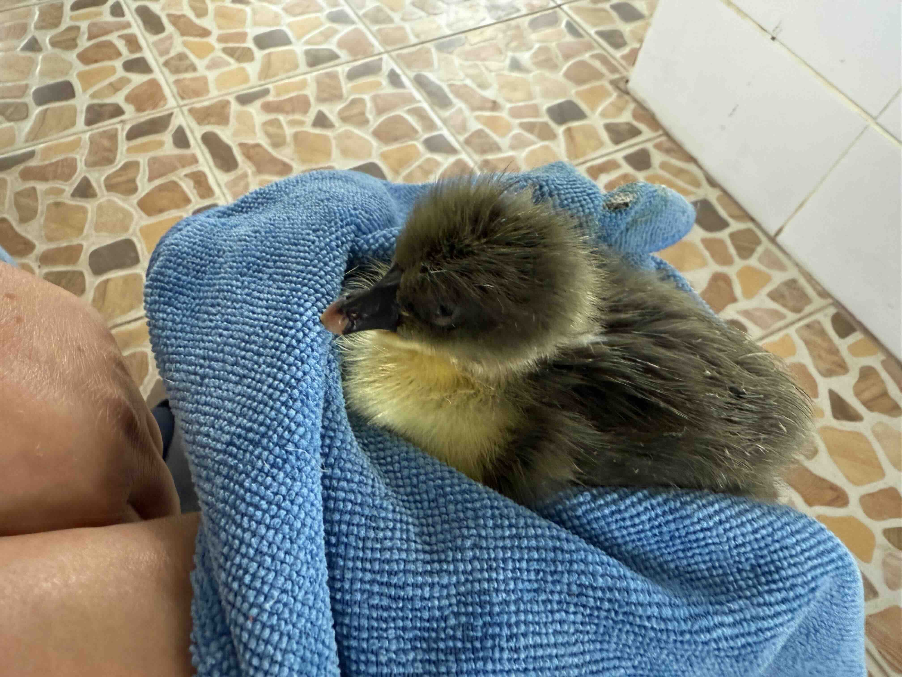

# 20250127_chiangrai

<html>
<head>

<meta charset="UTF-8">
<meta http-equiv="Content-Type" content="text/html; charset=UTF-8">
<meta http-equiv="X-UA-Compatible" content="IE=EmulateIE10" />
<meta http-equiv="X-UA-Compatible" content="IE=edge">

<!--ここから上はお決まりの定型文です-->

<!--ここからが表現の書式などを決めるcssという部分-->

<link href="https://cdnjs.cloudflare.com/ajax/libs/lightbox2/2.7.1/css/lightbox.css" rel="stylesheet">

</head>

<body>

モバイル端末をお使いの場合は、画面を横向きにすると
より見やすくご覧頂けます。

<!--ここ上は、ほぼそのまま使います！-->

<!--QRコードの挿入例-->

 アクセス用QRコード

<marquee direction="left" scrollamount="20" width="30%">(^_^)/~alis</marquee>

<!--流れ文字の挿入例-->
<h1><marquee behavior="left">!!! 2025/01/27、朝から物干しキャリアの組み立て、一日中曇りでお花と動物のお世話で終了!!!</marquee></h1>

                          

<!--ここから下が、本体部分-->

<h2>昨日買った物干しキャリアを朝一で組み立て、小一時間で無事完了</h2>

<h2>ハスの鉢で飼っているメダカ達に餌をあげます</h2>
<iframe width="560" height="315" src="https://www.youtube.com/embed/g2RBIDF1-aA?si=j7VrKE65eY2kTMLx" title="YouTube video player" frameborder="0" allow="accelerometer; autoplay; clipboard-write; encrypted-media; gyroscope; picture-in-picture; web-share" referrerpolicy="strict-origin-when-cross-origin" allowfullscreen></iframe> 

<h2>庭のお花に小さな虫、肉眼では見逃してしまいそうなサイズでした</h2>

<h2>お花は最後にこの実になっておしまい</h2>

<h2>曇り空でも黄色のお花は鮮やか</h2>

<h2>この木のお花は開かずに落ちちゃいます</h2>

<h2>ほぼこのままの姿でみんな落ちます</h2>

<h2>木の下は仏壇なので、落ちたお花を拾ってお供えしました</h2>

<h2>アヒル一家は元気にお散歩</h2>

<h2>遅れてかえったヒナが置き去りだったので一時保護 画像クリックで動画再生します ↓</h2>

<h2>ニワトリ親子は野生生物が怖くて、人間エリアに避難中</h2>
<iframe width="560" height="315" src="https://www.youtube.com/embed/LhQc1Wmqtzs?si=a4Mf4qiRtRSfPfTa" title="YouTube video player" frameborder="0" allow="accelerometer; autoplay; clipboard-write; encrypted-media; gyroscope; picture-in-picture; web-share" referrerpolicy="strict-origin-when-cross-origin" allowfullscreen></iframe> 

<h2>カメラ向けると庭に戻るも、ひと塊りになって安全確保</h2>
<iframe width="560" height="315" src="https://www.youtube.com/embed/3vemukohPvQ?si=U4l0z4dZLW99TPmq" title="YouTube video player" frameborder="0" allow="accelerometer; autoplay; clipboard-write; encrypted-media; gyroscope; picture-in-picture; web-share" referrerpolicy="strict-origin-when-cross-origin" allowfullscreen></iframe> 

<h2>猫の餌におまけでついてくる爪研ぎハウスに妊娠中の猫ちゃんを入れます</h2>

<h2>ちょっと狭いのか、すぐに出てきちゃいました</h2>

<h2>今夜のBGMは、かなりシックになりました</h2>
<iframe width="560" height="315" src="https://www.youtube.com/embed/-gIIUojD_Ng?si=im-KwCZPE7etW6Z_" title="YouTube video player" frameborder="0" allow="accelerometer; autoplay; clipboard-write; encrypted-media; gyroscope; picture-in-picture; web-share" referrerpolicy="strict-origin-when-cross-origin" allowfullscreen></iframe> 

   
<h2>以上、昨日ばらして運んだ物干しキャリアの組み立てでスタートした一日。 一日中曇りで綺麗なお空は見られず、動物の世話がメインでした。 ここまで観ていただきありがとうございました。</h2>

     
<h2>
<a href="https://torokoid.github.io/20241126_chiangrai/" target="_blank">Back to the menu page</a>
</h2>

   

         

  

      

<!--本体はここまで-->

<!--画面に空白地帯を作って、背景が見えるようにしています-->
                                              

<!-- フッタ -->
<footer>

Copyright 2025/01/28 alis @ChiangRai

</footer>

<!--HPにさまざまなJavaScriptを呼び込むための書式-->

